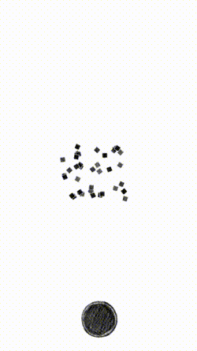

# Actions

This sample app shows how to use declarative animations (`SKActions`)
to create a camera shake.

To run the application:

`rake` will run the app in the iPhone 6 simulator.

Here's what it looks like:

  

High level project structure:

- The camera shake will occur when the button at the button is
  pressed.
- All nodes are contained in a top level `SKNode` called `@camera`.
- The `shake` function alternates shaking in the x direction (denoted
  by `direction_x`.
- The number of shakes is denoted by the `how_many` variable.
- The random distance the camera moves lessens with every shake, which
  is calculated and stored in the `from` and `to` variables.
- An array of `SKAction`s are collected with a random x and random y
  (denoted by the `randX` and `randY` variables).
- A final `SKAction` is applied to the camera which places the node
  back at postion (0, 0).
- The sequence of `SKAction`'s are applied to `@camera` using the
  `runAction` function.
