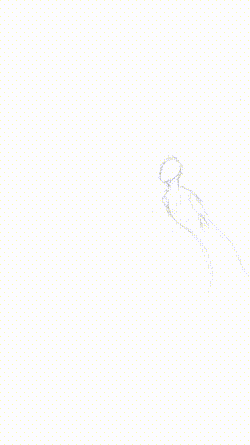

# Animating a Sprite

This sample app shows how to use declarative animations (`SKActions`)
to animate a sprite as if it were moving.

To run the application:

`rake` will run the app in the iPhone 6 simulator.

Here's what it looks like:

  

High level project structure:

- This is very similar to the `actions` sample code.
- Each sprite is loaded into an array.
- The `SKAction.animateWithTextures` is used to enumerate the sprites.
- The action is repeated forever using `SKAction.repeatActionForever`.
