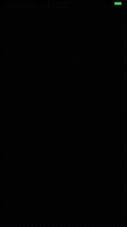

# Collision Detection

This sample app shows how to set up a physics body and apply collision
detection to sprites.

To run the application:

`rake` will run the app in the iPhone 6 simulator.

Here's what it looks like:

  

High level structure:

- In `didMoveToView`, `gravity` is removed and a `contactDelegate` is
  set to `self`.
- The `@ball` is giving a `categoryBitMask`, and a
  `contactTestBitMask`.
- The `@wall` is given the opposite `categoryBitMask`, and a
  `contactTestBitMask`.
- The `@ball` and `@wall` are each given a `physicsBody` via apis
  provide by `SKPhysicsBody`.
- During the `update` loop, the `@ball` is moved up and down within
  the bounds of the screen.
- The `didBeginContact` method is called whenever a collision occurs
  (I do a particle effect whenever a collision occurs).
