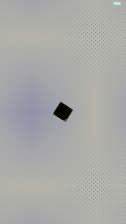

# Create a Single Sprite

This sample app shows how to create a single sprite and make it spin.

To run the application:

`rake` will run the app in the iPhone 6 simulator.

Here's what it looks like:

  

High level structure:

- Sprites are created using `SKSpriteNode`.
- Sprite textures are located in the `resources` directory.
- There is a property on `SKSpriteNode` called `zRotation` (radians) which you
  can use to turn a sprite.
- The sprite is turned within the `update` method.
