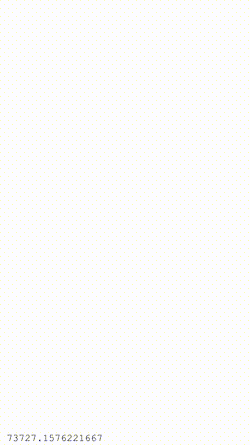

# Sprite Kit Hello World

SpriteKit is a framework created by Apple specifically designed to
build 2D games.

This is a really really simple applications that shows how to display
an `SKScene` (`SpriteKit` scene) with an update loop (where all the
work is done). Inside of this loop, an `SKLabelNode` is updated with
the `currentTime`.

To run the application:

`rake` will run the app in the iPhone 6 simulator.

Here's what it looks like:

<p align="center" style="border: solid 1px silver;">
  
</p>

I've added a couple of helper rake tasks to run on different types of
devices, but keep in mind that the simulators are _not_ a replacement
for testing on a real device (_especially_ for games):

- `rake sim:five`
- `rake sim:six`
- `rake sim:plus`
- `rake sim:ipad`
- `rake sim:ipadpro`

Feel free to create your own aliases in the `Rakefile`. If any of the
rake tasks above don't work:

- Run `rake`.
- When the simulator starts up, click Hardware->Device->iOS 10.0.
- You'll see a list of simulator names there. You may have to use
  XCode to download new simulators.
- You can run any of the simulators by running:

```
rake simulator device_name='THE SIMULATOR NAME'
```

High level structure:

- All code is located in the `app` folder.
- Icons and splash screens are located in the `resources`.
- `app_delegate.rb` is the entry point of the application. This is
  where the work is done to present a container view that houses our
  scene. `app_delegate.rb` is also where you'd put code for different
  types of top level iOS events (such memory warnings, events for
  when the app is about to terminate/go into the background).
- `game_view_controller.rb` is just a container for the game, nothing
  really interesting there.
- `game_scene.rb` is where all the meat is.
