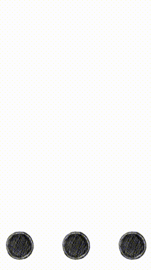

This sample app shows how to create assorted particle effects programmatically.

To run the application:

`rake` will run the app in the iPhone 6 simulator.

Here's what it looks like:

  

High level project structure:

- All code is located in the `app` folder.
- Icons and splash screens are located in the `resources`.
- `app_delegate.rb` is the entry point of the application. This is
  where the work is done to present a container view that contains our
  scene. `app_delegate.rb` is also where you'd put code for different
  types of top level iOS events (such memory warnings, events for
  when the app is about to terminate/go into the background).
- `game_view_controller.rb` is just a container for the game, nothing
  really interesting there.
- `game_scene.rb` is where all the meat is.
